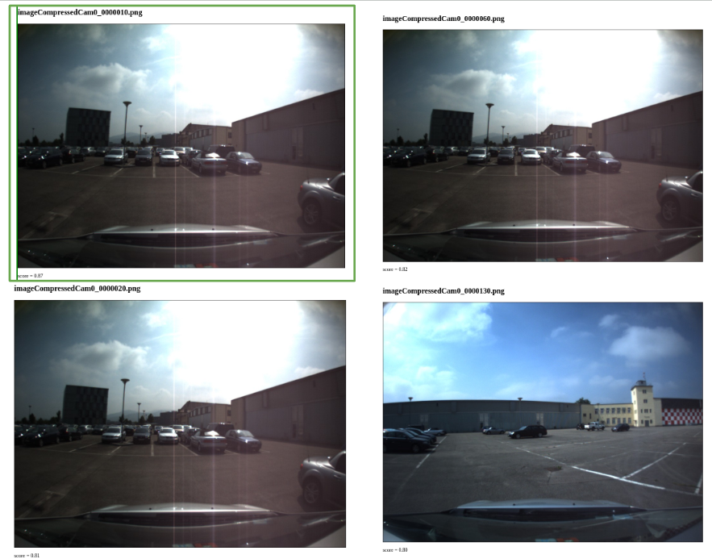

# Visual Place Recognition



 

## Installation: 
***Note - there is no dataset included due to space constraints***

1. Clone repo

```bash
git clone git@github.com:baj31415/visual-place-recognition.git \
&& cd visual-place-recognition
```
2. Build

```bash
mkdir build && cd build
cmake ..
make 
```
3. Run executable, which should generate a html file for the the most similar images in the dataset to the query image
```bash
./main
```
4. Open the webpage in a web browser


### Features Implemented

- [x] Sift Descriptors for each image in the dataset
- [x] Kmeans clustering of the Sift descriptors 
- [x] Bag of Visual Words Dictionary 
- [x] Histogram Computation
- [x] Concatenation of Histograms from the Dataset
- [x] TF-IDF on the Histograms
- [x] Histogram comparison with cosine similarity 


